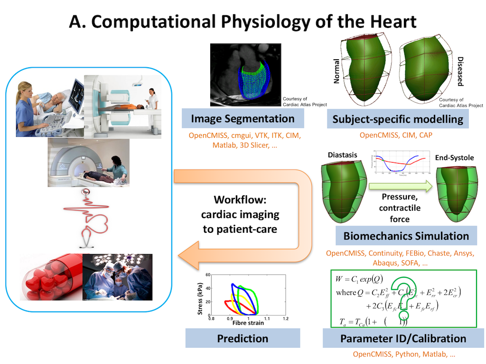
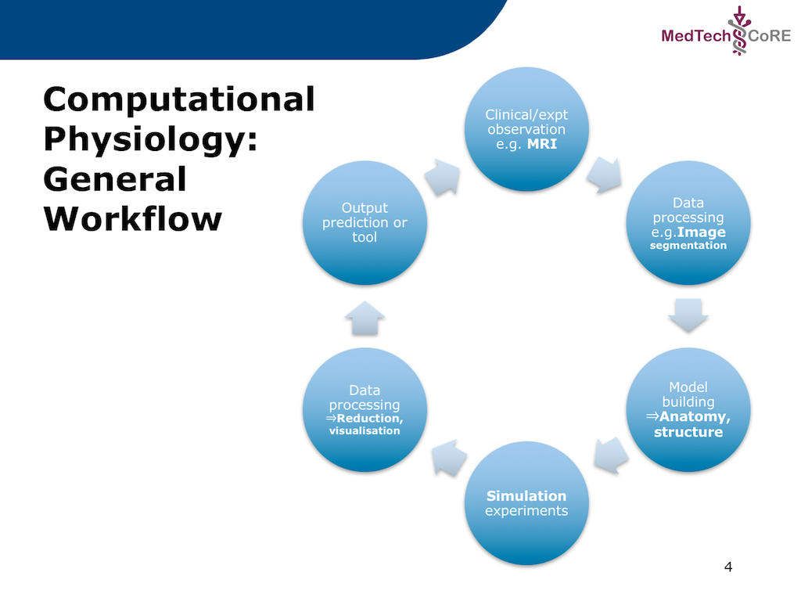
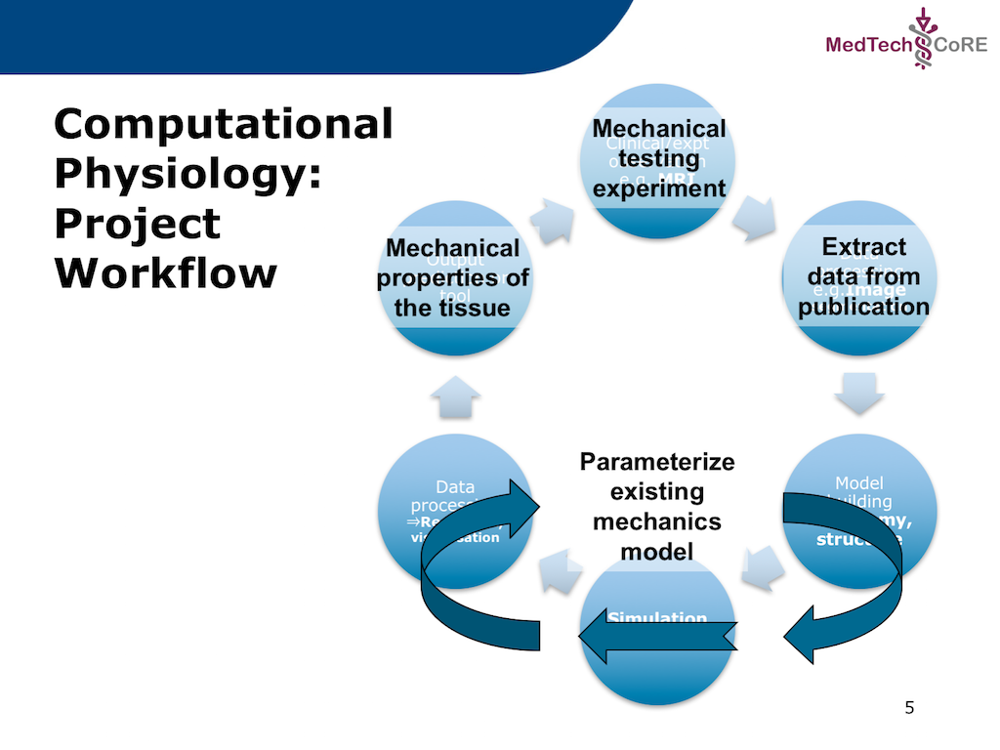

.. _dtp_cp_project_parameterestimation:

Project: Parameter Estimation
=============================

This project was created as part of the Computational Physiology module in the `MedTech CoRE 
<http://medtech.org.nz>`_ Doctoral Training Programme. 

This project requires you to put together what you have learned in the tutorials to define a complete workflow which we will use to manually optimise the material properties of a tissue model for use in mechanical simulations.

Outline
-------

In this project we recreate a typical workflow that is often performed by scientists when creating a model. The standard cardiac workflow used in the DTP module is shown in :numref:`fig_dtp_cp_estimationproject_cardiac`, which can be abstracted into the generic workflow shown in :numref:`fig_dtp_cp_estimationproject_generic`.

.. _fig_dtp_cp_estimationproject_cardiac:

   The standard example cardiac workflow used in the DTP Computational Physiology module.

.. _fig_dtp_cp_estimationproject_generic:

   The generic DTP Computational Physiology workflow.
   
In this project, we adapt the generic workflow shown in :numref:`fig_dtp_cp_estimationproject_generic` to the specific scenario we are recreating. The specific workflow for this project is described in :numref:`fig_dtp_cp_estimationproject_projectwf`.

.. _fig_dtp_cp_estimationproject_projectwf:

   The specific workflow for this project. The output for this workflow is to predict the passive mechanical material properties of a piece of cardiac tissue given the results from a mechanical testing experiment. As is commonly done, the actual experimental data will be extracted from a published paper where the actual data is only available as a printed figure. The extracted data will be used to predict the material properties of an existing cardiac tissue model.

You will need to start MAP Client and create a new workflow via the menu item  :menuselection:`File --> New --> Workflow`. This just requires you to select a folder: create a new, empty folder, for example "estimationproject" on the Desktop, and select it.

