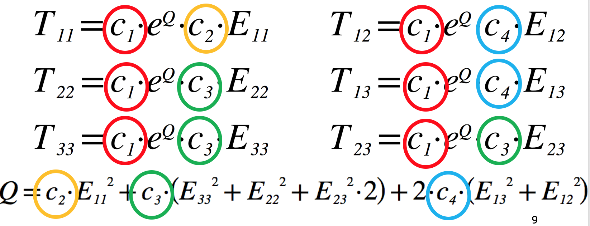

.. _dtp_cp_project_parameterestimation:

Project: Parameter Estimation
=============================

This project was created as part of the Computational Physiology module in the `MedTech CoRE 
<http://medtech.org.nz>`_ Doctoral Training Programme. 

This project requires you to put together what you have learned in the tutorials to define a complete workflow which we will use to manually optimise the material properties of a tissue model for use in mechanical simulations.

Outline
-------

In this project we recreate a typical workflow that is often performed by scientists when creating a model. The standard cardiac workflow used in the DTP module is shown in :numref:`fig_dtp_cp_estimationproject_cardiac`, which can be abstracted into the generic workflow shown in :numref:`fig_dtp_cp_estimationproject_generic`.

.. _fig_dtp_cp_estimationproject_cardiac:

   The standard example cardiac workflow used in the DTP Computational Physiology module.

.. _fig_dtp_cp_estimationproject_generic:

   The generic DTP Computational Physiology workflow.
   
In this project, we adapt the generic workflow shown in :numref:`fig_dtp_cp_estimationproject_generic` to the specific scenario we are recreating. The specific workflow for this project is described in :numref:`fig_dtp_cp_estimationproject_projectwf`.

.. _fig_dtp_cp_estimationproject_projectwf:

.. figure:: _static/DTP-CP-Workflow-03.png
   :align: center
   :width: 90%

   The specific workflow for this project. The output for this workflow is to predict the passive mechanical material properties of a piece of cardiac tissue given the results from a mechanical testing experiment. As is commonly done, the actual experimental data will be extracted from a published paper where the actual data is only available as a printed figure. The extracted data will be used to predict the material properties of an existing cardiac tissue model.

Geometric model
---------------

As you may know, caridac tissue consists of cells aligned in fibres, as shown in :numref:`fig_dtp_cp_estimationproject_cardiacfibres`. Mechanically, the tissue is much stiffer in the fibre direction than in the cross-fibre direction, and so it is very important for any model of cardiac tissue to take this into account.

.. _fig_dtp_cp_estimationproject_cardiacfibres:

.. figure:: _static/cardiac-fibres.png
   :align: center
   :width: 90%

   Illustrations of the fibrous nature of cardiac tissue. 

In this project, we use the simplified geometric model shown in :numref:`fig_dtp_cp_estimationproject_mesh`. While this is a relatively trivial model, it is a reasonable approximation to an often used experimental preparation - the `cardiac trabecula <https://en.wikipedia.org/wiki/Trabeculae_carneae>`_.

.. _fig_dtp_cp_estimationproject_mesh:

.. figure:: _static/mesh.png
   :align: center
   :width: 90%

   The specific geometric model used in this project. In this tissue model the muscle fibres are aligned in the same direction, indicated by the silver line. The blue plane indicates the orthogonal direction.
   
:numref:`fig_dtp_cp_estimationproject_simulationresults` shows some simulation results when performing some passive stretch experiments using the tissue model from :numref:`fig_dtp_cp_estimationproject_mesh`. These results illustrate the difference in material properties when stretching the tissue in the fibre vs cross-fibre direction.

.. _fig_dtp_cp_estimationproject_simulationresults:

.. figure:: _static/simulation-results.png
   :align: center
   :width: 90%

   Simulation results from performing passive stretch experiments with our cardiac tissue model. The results on the left show the resulting deformation and reaction forces when stretching the tissue in the direction of the tissue fibres, while those on the right show the results when stretching in the cross-fibre direction. Each pair of results is the same applied stretch. In particular, notice the much larger reaction forces in the fibre stretches - i.e., much more energy needs to be applied in order to stretch the tissue along the fibres compared to across the fibres for the same magnitude stretch.

Data collection
---------------

The first step in this project is to collect the experimental data that will be used in estimating the material properties of this tissue. In this project we are using simulated experimental data so that we have some hope that this will be an achievable task. You can see typical experimental data from a real cardiac trabecula that would be used in a lab here: https://youtu.be/_VHZyPEpxsc. 

Since our model is homogeneous and transversely isotropic, we can reduce the data required to parameterise the model to two stress-strain relationships - one for the fibre direction and one of the orthogonal cross-fibre direction (see :numref:`fig_dtp_cp_estimationproject_simulationresults`). Example data similar to what we will use is shown in :numref:`fig_dtp_cp_estimationproject_data` and a potential segmentation method used to extract the numerical values of the data is shown in :numref:`fig_dtp_cp_estimationproject_segmentation`.

.. _fig_dtp_cp_estimationproject_data:

   Example "experimental" data that could be used to estimate the material properties of our cardiac tissue model. This is not the data to be used in this project.

.. _fig_dtp_cp_estimationproject_segmentation:

.. figure:: _static/manual-segmentation.png
   :align: center
   :width: 90%

   Illustrating the "manual segmentation" method that could be used to obtain the actual experimental data.

In this project, you will need to segment the stress-strain data available in this high-impact scientific paper: https://doi.org/10.17608/k6.auckland.9810233.v1. You may use any method you like to segment the data. When extracting the numerical values, you will need to collect **5 data points** for each of the fibre and cross-fibre relationships.
   
Constitutive model
------------------

For this project, we want to predict the passive material properties of the cardiac tissue given the observed experimental data in :numref:`fig_dtp_cp_estimationproject_data`. So in addition to the geometric model in :numref:`fig_dtp_cp_estimationproject_mesh` we need a material constitutive model that captures the cardiac tissue properties that we are interested in. For this project we will use the `Guccione model <http://www.ncbi.nlm.nih.gov/pubmed/2020175?dopt=Abstract>`_. This model, and many other potential models to use, is available in the Physiome Repository - https://models.physiomeproject.org/e/26d/guccione.cellml/view. **You will need to download the CellML file for this model from the repository, make sure you save it somewhere convenient.**

The equations for the Guccione model are shown in :numref:`fig_dtp_cp_estimationproject_guccione` (you can see the exact equations used in the model repository - https://models.physiomeproject.org/e/26d/guccione.cellml/@@cellml_math).

.. _fig_dtp_cp_estimationproject_guccione:
   

   The equations of Guccione model defining the 6 components of the stress tensor, *T*, given the 6 components of the strain tensor, *E*. The four material parameters we want to estimate in this project are highlighted (c\ :sub:`1` ... c\ :sub:`4`). The transverse isotropic nature of this model can be seen by comparing the equation for the fibre stress (T\ :sub:`11`) to that for both of the the cross-fibre stresses (T\ :sub:`22` and T\ :sub:`33`). Understanding which material parameters are important for each of the stress-strain relationships will help guide your parameter estimation.
   

Workflow construction
---------------------

Following the "manual segmentation" method, we will be using a manual parameter estimation method to predict the passive material properties of the cardiac tissue described in :numref:`fig_dtp_cp_estimationproject_data`. Therefore, the second step in this project is to construct a workflow in MAP Client that will let you perform some simulations using the cardiac tissue model with your estimated material parameters, and then compare your simulation results to the data you measured.

You will need to start MAP Client and create a new workflow via the menu item  :menuselection:`File --> New --> Workflow`. This just requires you to select a folder: create a new, empty folder, for example :file:`estimationproject` on the Desktop, and select it.

For this project you will need to make use of the following MAP Client steps.

* :guilabel:`Iron Simulation` -- to perform the actual simulation.
* :guilabel:`Simulation Review` -- to compare simulated data to measured data.
* :guilabel:`Graph Segmentation` -- to enter the numeric values extracted from the experimental data.
* :guilabel:`File Chooser` -- to provide the CellML file for the Guccione model.
* :guilabel:`Directory Chooser` -- to define an *output* folder to store the simulation results.
* :guilabel:`Parameter Setting` -- to define your current estimate of the passive material properties.

We suggest starting with the :guilabel:`Iron Simulation` step and using the port definitions to determine the workflow connectivity. In the configuration of the workflow, you should be able to enter your current estimates for the four material parameters and the numeric values measured from the experimental data. The :guilabel:`Graph Segmentation` step expects 10 data points to be given -- the first 5 should be the fibre direction and the second 5 the cross-fibre direction.

On execution, your workflow should perform the required simulations and present you with a comparison of your simulation results with the measured experimental data.

Parameter estimation
--------------------

As mentioned, we will be using a manual estimation process in this project. This requires you to use your workflow to estimate parameter values and compare the predicted tissue behaviour to that you have measured from the experimental data. And then repeat until you are happy with the comparison.

Some tips that might help:

* the parameter values are whole numbers
* what is the main effect of each of the parameters?
* how accurate are your measured values?
* how accurate is the printed graph?

